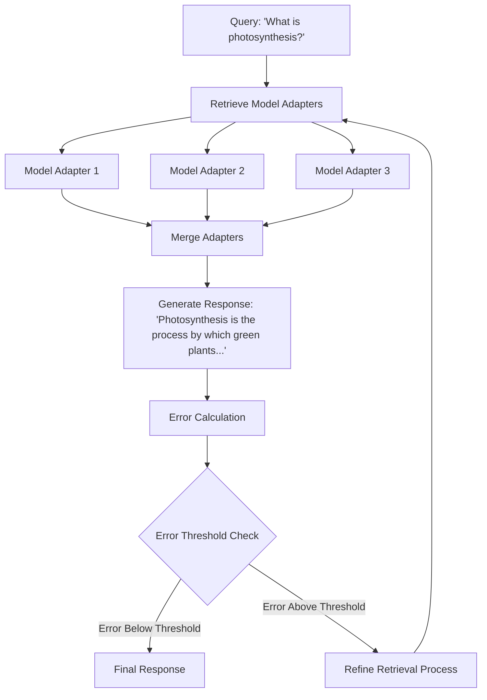

### Mixture of Adapters

#### 1. **Objective**
Develop a system to store and retrieve model adapters based on their relevance to specific tasks, particularly next token generation. By selectively merging these adapters according to their query relevance, we aim to improve the efficiency and accuracy of model outputs.

#### 2. **Retrieval Mechanism: The Contriever**
- **Rationale**: To achieve efficient and relevant retrieval of model adapters, we can employ a 'Contriever' mechanism, as illustrated in the [Atlas](https://arxiv.org/pdf/2208.03299.pdf) research paper.
  
#### 3. **Training Signal: Adapter Error Contribution**
- **Principle**: To enhance the retrieval process, each adapter's contribution to the error can serve as a training signal.
- **Comparison**: This approach mirrors the fine-tuning process observed in Retrieval-Augmented Generation (RAG) systems.

#### 4. **Extension: Expert Adapter Training**
- **Concept**: Take this primary idea further by segmenting the training of these 'expert adapters'.
- **Benefit**: Segmentation of fine-tuning provides superior compartmentalization, allowing for specialized knowledge and capabilities within each adapter.

In sum, this system aims to maximize efficiency in next token generation by harnessing the power of selectively merged model adapters, optimized through a sophisticated retrieval mechanism and segmented training.
# Model Adapter Storage & Retrieval System

This system aims to store and retrieve model adapters based on their relevance to tasks like next token generation.

